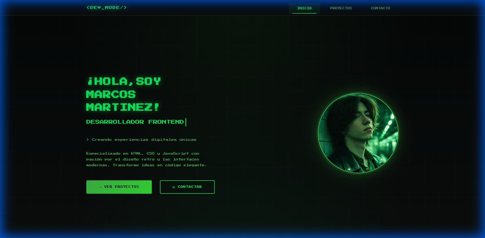
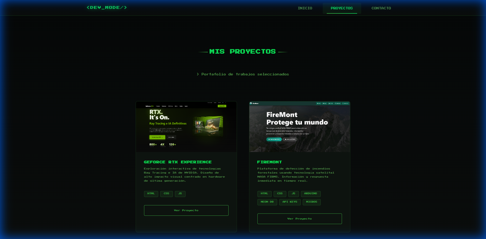
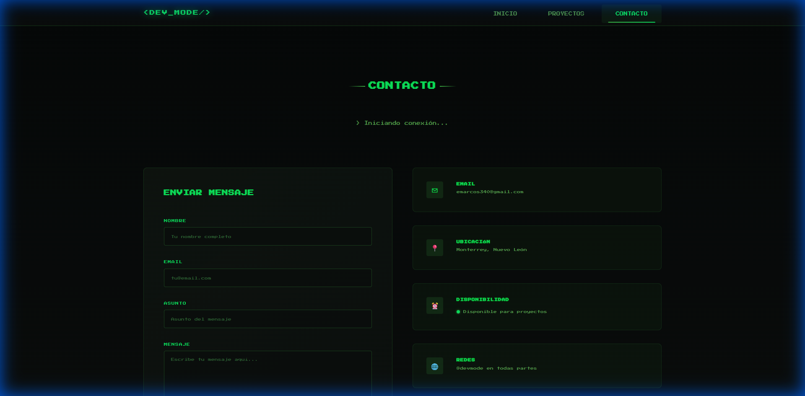

# 🎮 Portafolio Web Retro 8-Bit


## 📝 Descripción

Portafolio web de desarrollador frontend con estética **retro 8-bit**. Desarrollado con tecnologías web puras (HTML, CSS y JavaScript) sin frameworks, optimizado para todos los dispositivos.

### ✨ Características Principales

- 🎨 **Diseño Retro 8-Bit**: Estética inspirada en terminales antiguas y videojuegos clásicos.
- 😎 **Paleta de Colores Verde**: Tonos verdes vibrantes (#3CB043, #0CE25E, #31D633).
- 📱 **Totalmente Responsive**: Adaptado para móvil (375px), tablet (768px) y desktop (1024px+).
- ⚡ **Animaciones Fluidas**: Efectos de glitch, escaneo CRT y transiciones suaves.
- 🎯 **3 Páginas Completas**: Inicio, Proyectos y Contacto.
- 🔊 **Efectos Interactivos**: Sonidos retro y animaciones al interactuar.
- 🎮 **Easter Egg**: Código Konami secreto.

---

## 🛠️ Tecnologías Utilizadas

- **HTML5**: Estructura semántica y accesible.
- **CSS3**: Diseño responsive con variables CSS, Grid y Flexbox.
- **JavaScript Vanilla**: Interactividad sin dependencias externas.
- **Google Fonts**: Tipografías retro (Press Start 2P, VT323).

---

## 📂 Estructura del Proyecto

```
App web/
├── index.html              # Página de inicio
├── proyectos.html          # Página de proyectos
├── contacto.html           # Página de contacto
├── css/
│   ├── style.css          # Estilos principales
│   ├── retro.css          # Efectos retro y animaciones
│   └── responsive.css     # Media queries
├── js/
│   ├── navigation.js      # Sistema de navegación
│   └── main.js            # Funcionalidad principal
├── assets/
│   ├── images/            # Imágenes del portafolio
│   └── icons/             # Iconos retro
└── README.md              # Este archivo
```

---

## 🚀 Instalación y Uso Local

### Opción 1: Abrir Directamente

1. **Descargar el proyecto**
2. **Abrir en el navegador**
   - Navega a la carpeta del proyecto.
   - Haz doble clic en `index.html`.
   - ¡Listo! El sitio se abrirá en tu navegador predeterminado.

### Opción 2: Servidor Local (Recomendado)

#### Con Python:
```bash
python -m http.server 8000
```

#### Con Node.js (http-server):
```bash
npx http-server -p 8000
```

---

## 🎨 Paleta de Colores

| Color | Hex | Uso |
|-------|-----|-----|
| **Green** | `#3CB043` | Color primario, bordes |
| **Malachite** | `#0CE25E` | Color secundario, acentos |
| **Lime** | `#31D633` | Highlights, efectos |
| **Dark** | `#0a0e0d` | Fondo principal |
| **Darker** | `#050707` | Fondo oscuro |

---

## 🎯 Páginas del Sitio

### 1. **Inicio (index.html)**
- Sección hero con imagen circular.
- Grid de habilidades con barras de progreso.

### 2. **Proyectos (proyectos.html)**
- Visualización de proyectos destacados (GeForce RTX y FireMont).
- Enlaces directos a las aplicaciones en vivo.

### 3. **Contacto (contacto.html)**
- Formulario de contacto y enlaces a redes sociales.
- Opción de descarga de CV actualizada.

---

## 🎮 Easter Egg

Prueba el **código Konami** en cualquier página:
```
↑ ↑ ↓ ↓ ← → ← → B A
```

---

## 🎯 Requisitos Cumplidos

- [x] **3 páginas diferentes**: Inicio, Proyectos y Contacto con navegación fluida.
- [x] **Responsive**: Diseño optimizado para móvil (375px) y desktop (1024px+).
- [x] **Diseño moderno**: Paleta de colores coherente y tipografía legible con estética retro.
- [x] **Datos de ejemplo**: Contenido estático y funcional sin necesidad de backend.
- [x] **README completo**: Instrucciones de instalación y capturas de pantalla.

---

## 📸 Capturas de Pantalla

### Inicio


### Proyectos destacados


### Contacto


---

## 👨‍💻 Autor

**Marcos Martinez**
- GitHub: [emarcos340-commits](https://github.com/emarcos340-commits)
- LinkedIn: [Marcos Martinez](https://www.linkedin.com/in/marcos-martinez-dev/)
- Email: emarcos340@gmail.com

---

<div align="center">

`>>> SISTEMA_ONLINE <<<`

</div>
